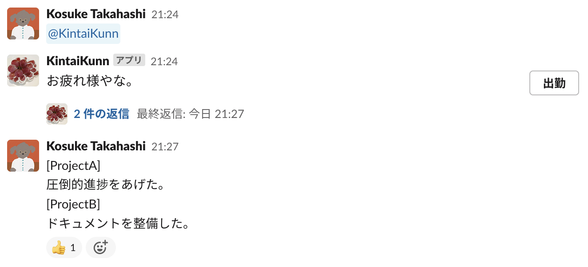
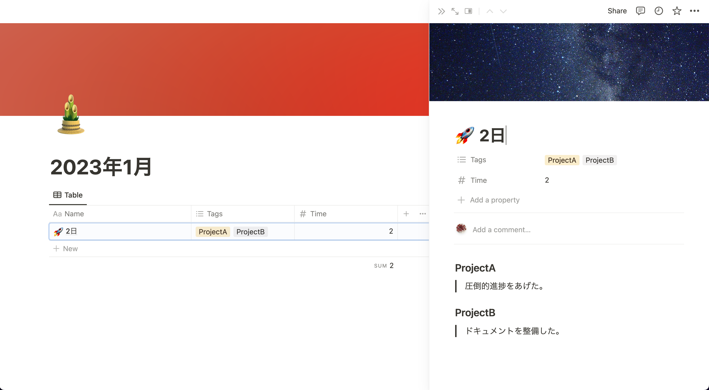
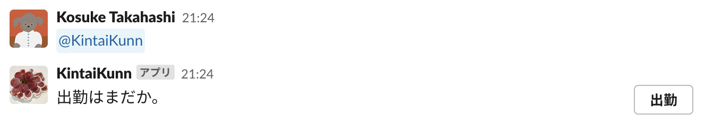
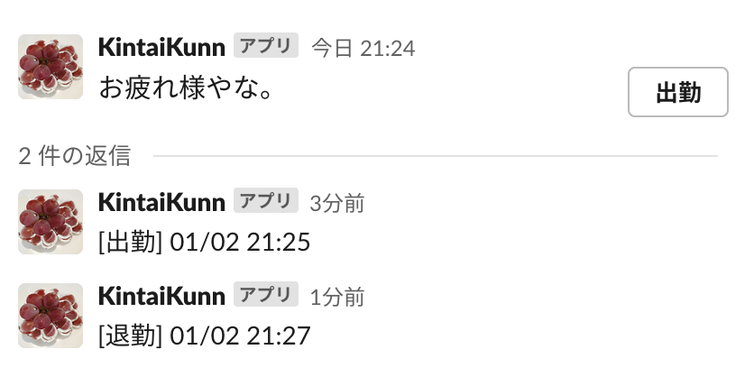
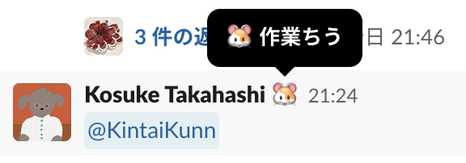
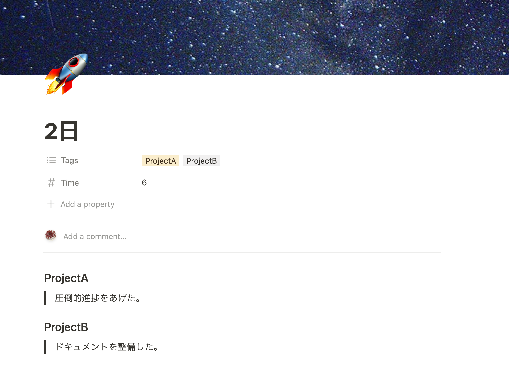

# SlackAppforKintai

# Slack と Notion で勤怠・進捗管理ができるアプリ

### **メンションすることで出勤ボタンを表示**

 
 

### **スレッドで出勤退勤時間を表示**

 
 

### **勤務中はステータスを変更**

 
 

### **[]でタグづけた項目と出勤から退勤までの時間を記録**

 
 

### **使用技術**

Bolt for Python (SlackAPI SDK)  
Notion API  
AWS Lambda
 
 

### **SlackApp に必要なスコープ**

**Bot Token Scopes**

- app_mentions:read
- channels:history
- chat:write
- reactions:write

**User Token Scopes**

- users.profile:write
